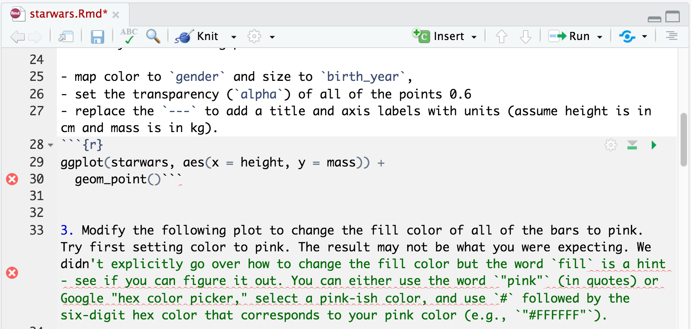

```{r child = "../setup.Rmd"}
```

```{r packages, echo=FALSE, message=FALSE, warning=FALSE}
library(tidyverse)
library(openintro)
loans_full_schema <- loans_full_schema %>%
  mutate(grade = factor(grade, ordered = TRUE))
```
class: middle
# Tips

---
class: inverse

## Be cognizant of chunk ticks

.pull-left[
Make sure your code is in the gray area of a chunk in between the lines containing the back-ticks and curly brackets. 

.question[What is wrong with this code chunk?]
]

.pull-right[

]
---
class: inverse
## Be cognizant of parentheses

.pull-left[
- Make sure every open parenthesis (or bracket) is closed

- Make sure to close parentheses in the correct place (when you have a lot of nested functions, incorrectly closing your parentheses is very easy to do)

.question[What is wrong with this code?]
]

.pull-right[
```{r, include = TRUE, eval = FALSE}
ggplot(mtcars, aes(x = mpg, y = disp) +
       geom_point())
```

]
---
class: inverse
## Be cognizant of parentheses

.pull-left[
- Make sure every open parenthesis (or bracket) is closed

- Make sure to close parentheses in the correct place (when you have a lot of nested functions, incorrectly closing your parentheses is very easy to do)

.question[What is wrong with this code?]
]

.pull-right[
```{r, include = TRUE, eval = FALSE}
ggplot(mtcars, aes(x = mpg, y = disp) +
       geom_point()
```
]
---
class: inverse
## Be cognizant of parentheses

.pull-left[
- Make sure every open parenthesis (or bracket) is closed

- Make sure to close parentheses in the correct place (when you have a lot of nested functions, incorrectly closing your parentheses is very easy to do)

.question[What is wrong with this code?]
]

.pull-right[
```{r, include = TRUE, eval = FALSE}
ggplot(mtcars, aes(x = mpg, y = disp)) +
       geom_point()
```

]
---
## Enter your PAT each time you start a new R session

- Type `credentials::set_github_pat("your-PAT")` into the console. 

- Replace your-PAT with the long string of letters and numbers you generated in GitHub

- Your PAT should be cached in RStudio Cloud for 12 hours. You might as well just get into the habit of setting it at the beginning of each new session in which you need to push to or pull from GitHub.

- Save your PAT somewhere on your local computer that is quickly accessible

- **NEVER** include your PAT in a .Rmd file. This is equivalent to including your private password in a shared document.   
---
### Keyboard shortcuts (see Help / Keyboard shortcuts help for more info)

**Insert chunk:** Insert a chunk into your .Rmd
- Mac: cmd + I
- PC: ctrl + I
  
**Run current line of code:** Place your cursor on code that you would like to run in your .Rmd.
- Mac: cmd + enter
- PC: ctrol + enter

**Pull up command history:** Place your cursor in the console and hit the up arrow. Your most recent command will appear. Hit the up arrow to see the command you ran before that, etc. 

---
class: middle

# Recap

---

## Variables

- **Numerical** variables can be classified as **continuous** or **discrete** based on whether or not the variable can take on an infinite number of values or only non-negative whole numbers, respectively.

- If the variable is **categorical**, we can determine if it is **ordinal** based on whether or not the levels have a natural ordering.

---

### Data 

```{r}
library(openintro)
loans <- loans_full_schema %>%
  select(loan_amount, interest_rate, term, grade, 
         state, annual_income, homeownership, debt_to_income)
glimpse(loans)
```

---

class: middle

# Bar plot

---

## Bar plot: one categorical variable

```{r}
ggplot(loans, aes(x = homeownership)) +
  geom_bar()
```

---

## Segmented bar plot: two categorical variables

```{r}
ggplot(loans, aes(x = homeownership, 
                  fill = grade)) + #<<
  geom_bar()
```

---

## Segmented bar plot: two categorical variables

```{r}
ggplot(loans, aes(x = homeownership, fill = grade)) +
  geom_bar(position = "fill") #<<
```

---
class:inverse
.question[
Which bar plot is a more useful representation for visualizing the relationship between homeownership and grade?
]

.pull-left[
```{r echo=FALSE, out.width = "100%"}
ggplot(loans, aes(x = homeownership, fill = grade)) +
  geom_bar()
```
]
.pull-right[
```{r echo=FALSE, out.width = "100%"}
ggplot(loans, aes(x = homeownership, fill = grade)) +
  geom_bar(position = "fill")
```
]

---

## Customizing bar plots

.panelset[
.panel[.panel-name[Plot]
```{r ref.label = "bar-custom", echo = FALSE, warning = FALSE}
```
]
.panel[.panel-name[Code]
```{r bar-custom, fig.show = "hide", warning = FALSE}
ggplot(loans, aes(y = homeownership, #<<
                  fill = grade)) +
  geom_bar(position = "fill") +
  labs( #<<
    x = "Proportion", #<<
    y = "Homeownership", #<<
    fill = "Grade", #<<
    title = "Grades of Lending Club loans", #<<
    subtitle = "and homeownership of lendee" #<<
  ) #<<
```
]
]

---

class: middle

# Relationships between numerical and categorical variables

---

## We already talked about...

- Coloring and faceting histograms and density plots

- Side-by-side box plots

---

## Violin plots: probability density turned sideways

```{r warning = FALSE}
ggplot(loans, aes(x = homeownership, y = loan_amount)) +
  geom_violin()
```

---

### Ridge plots: multiple probability density distributions

```{r warning = FALSE}
library(ggridges)
ggplot(loans, aes(x = loan_amount, y = grade, fill = grade, color = grade)) + 
  geom_density_ridges(alpha = 0.5)
```

---

### Use use `stat = "identity"` to plot values instead of counts

.panelset[
.panel[.panel-name[Plot]
```{r ref.label = "bar-identity", echo = FALSE, warning = FALSE}
```
]
.panel[.panel-name[Code]
```{r bar-identity, fig.show = "hide", warning = FALSE}
ggplot(starwars[1:20,], aes(x = name, y = height)) +
  geom_bar(stat = "identity") #<<
```
]
]

---

### Plot `name` on the y-axis for better viz
.panelset[
.panel[.panel-name[Plot]
```{r ref.label = "bar-identity-rotate", echo = FALSE, warning = FALSE}
```
]
.panel[.panel-name[Code]
```{r bar-identity-rotate, fig.show = "hide", warning = FALSE}
ggplot(starwars[1:20,], 
       aes(x = height, 
           y = name)) + #<<
  geom_bar(stat = "identity")
```
]
]

---

### Reorder `name` by `height` for even better viz (and clean up labels and theme)
.panelset[
.panel[.panel-name[Plot]
```{r ref.label = "bar-identity-order", echo = FALSE, warning = FALSE}
```
]
.panel[.panel-name[Code]
```{r bar-identity-order, fig.show = "hide", warning = FALSE}
ggplot(starwars[1:20,], 
       aes(x = height, 
           y = reorder(name, height))) + #<<
  geom_bar(stat = "identity") +
  labs(x = "Height (cm)", #<<
       y = "", #<<
       title = "Starwars character height") + #<<
  theme_minimal() #<<
```
]
]

---

## If you finish the application exercise early...

- Explore other [ggplot geoms](https://ivelasq.rbind.io/blog/other-geoms/?utm_source=pocket_mylist)!

- Explore different [ggplot theme packages](https://towardsdatascience.com/themes-to-spice-up-visualizations-with-ggplot2-3e275038dafa)!

- Explore different [color palette packages](https://github.com/EmilHvitfeldt/r-color-palettes)!

---
