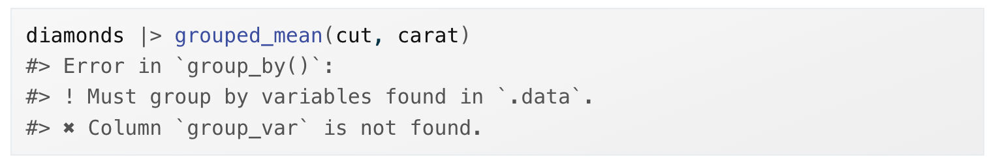

```{r packages, echo=FALSE, message=FALSE, warning=FALSE}
library(tidyverse)
```

## Recall, to turn your code into a function you need three things:

1. A **name**
2. The **arguments**
3. The **body**

# Mutate functions

## Mutate functions

<br>
Functions that work well inside of `mutate()` and `filter()` because they return output that is the same length as the input.

## An example: calculate z-score

Z-scores rescale a vector to have a mean of zero and a standard deviation of one. It can be useful when you want to do stats on datasets with very different value ranges.

::: columns
::: {.column width = "40%" .fragment}
```{r}
x <- c(0.01, 0.05, 0.004)

y <- c(40402, 495993, 589290)
```

:::
::: {.column width = "60%" .fragment}
```{r}
(x - mean(x, na.rm = TRUE)) / sd(x, na.rm = TRUE)
```

<br>

```{r}
(y - mean(x, na.rm = TRUE)) / sd(y, na.rm = TRUE)
```

::: 
:::

## An example: calculate z-score

Turn it into a function:

::: columns
::: {.column width = "50%" .fragment}
```{r}
zscore <- function(x){
  (x - mean(x, na.rm = TRUE)) / sd(x, na.rm = TRUE)
}
```

:::
::: {.column width = "50%" .fragment}
```{r}
zscore(x)
zscore(y)
```
::: 
:::


## An example: recode values in a vector

Create a function called `clamp()` that recodes values in a vector to be equal to some user-supplied minimum or maximum value if they are less than or greater than the min/max.

::: columns
::: {.column width = "50%"}
**Have:**
```{r echo=FALSE}
1:10
```

:::
::: {.column width = "50%"}
**Want:**
```{r echo=FALSE}
clamp <- function(x, min, max) {
  case_when(
    x < min ~ min,
    x > max ~ max,
    .default = x
  )
}
clamp(1:10, min = 3, max = 7)
```
::: 
:::

## An example: recode values in a vector

Create a function called `clamp()` that recodes values in a vector to be equal to some user-supplied minimum or maximum value if they are less than or greater than the min/max.

::: columns
::: {.column width = "50%" .fragment}
**Define the function:**
```{r}
clamp <- function(x, min, max) {
  case_when(
    x < min ~ min,
    x > max ~ max,
    TRUE ~ x
  )
}
```

:::
::: {.column width = "50%" .fragment}
**Execute the function:**
```{r}
clamp(1:10, min = 3, max = 7)
```
::: 
:::

## An example: mutate function with character data

Make the first letter of each value upper case.

::: columns
::: {.column width = "50%"}
**Have:**
```{r echo=FALSE}
c("hello", "goodbye", "see ya")
```

:::
::: {.column width = "50%"}
**Want:**
```{r echo=FALSE}
first_upper <- function(x) {
  str_sub(x, 1, 1) <- str_to_upper(str_sub(x, 1, 1))
  x
}

first_upper(c("hello", "goodbye", "see ya"))
```
::: 
:::

## An example: mutate function with character data

This one's a bit more complicated. First work out the code outside of the function. 

Ultimately, we can use the `str_sub()` function to sub out the lower case letter with an upper case letter.

From the help file: 

`str_sub(string, start = 1L, end = -1L, omit_na = FALSE) <- value`

<br>

::: columns
::: {.column width = "50%"}
```{r}
word <- "hello"
word
```

:::
::: {.column width = "50%"}
```{r}
str_sub(word, 1, 1) <- "H"
word
```
::: 
:::


## An example: mutate function with character data

We can use the `str_sub()` and `str_to_upper()` functions to programatically determine the replacement value.

::: columns
::: {.column width = "50%"}
```{r}
word
```
:::
::: {.column width = "50%"}
```{r}
str_to_upper(str_sub(word, 1, 1))
```
::: 
:::


## An example: mutate function with character data

Now put it all together.

::: columns
::: {.column width = "30%" .fragment}
```{r}
word
```

:::
::: {.column width = "70%" .fragment}
```{r}
str_sub(word, 1, 1) <- str_to_upper(str_sub(word, 1, 1))
word
```

::: 
:::


## An example: mutate function with character data

It worked. NOW make it a function.

::: columns
::: {.column width = "55%" .fragment}
**Define the function:**
```{r}
first_upper <- function(x) {
  str_sub(x, 1, 1) <- str_to_upper(str_sub(x, 1, 1))
  x
}
```


:::
::: {.column width = "45%" .fragment}
**Execute the function:**
```{r}
first_upper(word)

string <- c("hello", "goodbye", "see ya")
first_upper(string)
```
::: 
:::


# Summary functions

## Summary functions

Return a single value for use in `summarize()`

## An example: calculate standard error

se = sd / $n^{2}$

::: columns
::: {.column width = "50%" .fragment}
```{r}
se <- function(x){
  sd(x, na.rm = TRUE) / sqrt(length(x))
}
```

:::
::: {.column width = "50%" .fragment}
```{r}
x <- c(3, 6, 9)

se(x)
```

::: 
:::


## An example: standard error

::: columns
::: {.column width = "50%" .fragment}
```{r}
data <- tibble(x = c(1, 3, 5),
               y = c(6, 8, 9))

data
```

:::
::: {.column width = "50%" .fragment}
```{r}
data |> 
  summarize(mean_x = mean(x), 
            se_x = se(x),
            mean_y = mean(y),
            se_y = se(y))
```
::: 
:::

## Summary function with multiple vector inputs

Mean absolute percent error to compare model predictions with absolute values:

```{r}
mape <- function(actual, predicted) {
  sum(abs((actual - predicted) / actual)) / length(actual)
}
```


# Data frame functions

## Data frame functions

* Take a data frame as the first argument, some extra arguments that say what to do with it, and return a data frame or a vector.

* Useful if you find yourself using the same wrangling or plotting pipeline for different data or subsets of data.

## Get to know tidy evaluation

**Have:**
```{r}
diamonds
```

## Get to know tidy evaluation

**Want:** Calculate the mean of a variable (`mean_var`) based on a grouping variable (`group_var`) from the dataframe `df`. 
```{r}
grouped_mean <- function(df, group_var, mean_var) {
  df |> 
    group_by(group_var) |> 
    summarize(mean(mean_var))
}
```


## Get to know tidy evaluation

Why do we get an error?


## Get to know tidy evaluation

Why do we get an error?


* When function arguments are the name of a column, R takes it literally.

## Get to know tidy evaluation

::: columns
::: {.column width = "50%" .fragment}
What we want to happen: 
```{r eval = FALSE}
diamonds |> 
  group_by(cut) |> 
  summarize(mean(carat))
```
:::
::: {.column width = "50%" .fragment}
What is actually happening:
```{r eval = FALSE}
diamonds |> 
  group_by(group_var) |> 
  summarize(mean(mean_var))
```

Tidy evaluation allows us to refer to variable names directly when using tidyverse functions. But special treatment is required when you use these functions *inside another function* and column names are an argument of your custom function. 
::: 
:::


